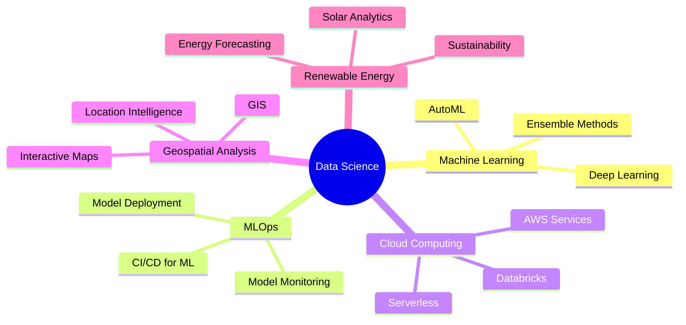

# Olá! 👋 Eu sou João Pedro Barbosa

<div align="center">
  
[](https://git.io/typing-svg)

</div>

<div align="center">
  
[](seu-github)
[](seu-linkedin)
[](seu-kaggle)
[](mailto:jpedrobarbosa.jpb@gmail.com)

</div>

---

## 🚀 Sobre Mim

```python
class DataScientist:
    def __init__(self):
        self.name = "João Pedro Barbosa"
        self.role = "Coordenador e Cientista de Dados"
        self.location = "Teresina, Brasil 🇧🇷"
        self.education = ["Engenharia Elétrica", "MBA em IA Aplicada"]
        self.languages = ["Português", "English", "Español"]
        
    def get_skills(self):
        return {
            "data_science": ["Machine Learning", "Deep Learning", "MLOps"],
            "cloud": ["AWS", "Databricks", "Docker"],
            "automation": ["Apache Airflow", "ETL Pipelines"],
            "visualization": ["Power BI", "Tableau", "Plotly"],
            "geospatial": ["QGIS", "Geopandas", "Leaflet.js"]
        }
    
    def current_focus(self):
        return "Transformando dados em decisões estratégicas 📊"

me = DataScientist()
print(me.current_focus())
```

---

## 🛠️ Tech Stack

### 💻 Linguagens


### 🤖 Machine Learning & IA


### 🗄️ Banco de Dados


### 📊 Visualização & BI


### ☁️ Cloud & DevOps


### 🗺️ Geoespacial


### 🛠️ Ferramentas


---

## 📈 Áreas de Atuação

<table>
<tr>
<td width="50%">

### 🔬 Data Science & Analytics
- Análise Estatística Avançada
- Modelagem Preditiva
- Feature Engineering
- A/B Testing
- Análise Exploratória de Dados

</td>
<td width="50%">

### 🤖 Machine Learning & MLOps
- Classificação e Regressão
- Modelos Ensemble
- MLflow para Versionamento
- Deploy de Modelos em Produção
- Monitoramento de Performance

</td>
</tr>
<tr>
<td width="50%">

### 🏗️ Data Engineering
- ETL Pipelines
- Automação com Airflow
- Containerização com Docker
- Arquitetura de Dados
- Data Quality & Governance

</td>
<td width="50%">

### 📊 Business Intelligence
- Dashboards Interativos
- KPIs e Métricas de Negócio
- Visualização de Dados
- Storytelling com Dados
- Insights Estratégicos

</td>
</tr>
</table>

---

## 🎯 Áreas de Interesse



---

## 📊 GitHub Stats

<div align="center">
  


</div>

---

## 🏆 GitHub Trophies

<div align="center">
  
[](https://github.com/ryo-ma/github-profile-trophy)

</div>

---

## 🎓 Certificações & Educação

🎓 **MBA em Inteligência Artificial Aplicada** - iCEV (em andamento)  
🎓 **Bacharelado em Engenharia Elétrica** - UFPI (2018-2024)

---

## 💡 Quote do Dia

<div align="center">


</div>

---

## 🐍 Contribution Snake

<div align="center">


</div>

---

## 📫 Vamos Conectar?

<div align="center">

💼 Aberto para colaborações em projetos de **Data Science**, **Machine Learning** e **MLOps**

📧 Entre em contato: **jpedrobarbosa.jpb@gmail.com**

⭐ **Se você gostou dos meus projetos, deixe uma estrela!**

</div>

---

<div align="center">
  
### 🌟 *"Transformando dados em decisões, código em soluções"* 🌟


</div>
